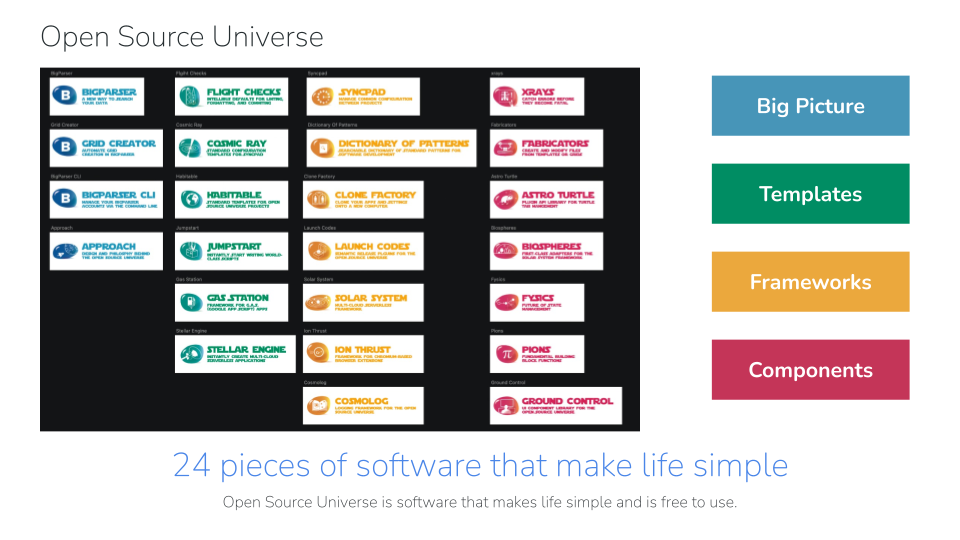

# Welcome to the Open Source Universe 👋

> [Open a PR & get a Personalized Open Source Universe T-Shirt 👕!](https://github.com/intellibus/approach/blob/main/REWARDS.md)

## Projects you can use today

1. [`bigparser`](https://github.com/intellibus/bigparser) — A New Way to Search Your Data
2. [`fysics`](https://github.com/intellibus/fysics) — Future of State Management
3. [`xrays`](https://github.com/intellibus/xrays) — Catch Errors Before They Become Fatal

## Projects under active development

1. [`bigparser-cli`](https://github.com/intellibus/bigparser-cli) — Manage Your BigParser Accounts Via The Command Line
2. [`cosmicray`](https://github.com/intellibus/cosmicray) — Standard Configuration Templates For Syncpad
3. [`fabricators`](https://github.com/intellibus/fabricators) — Create And Modify Files From Templates Or Grids
4. [`flightchecks`](https://github.com/intellibus/flightchecks) — Intellibus Defaults For Linting, Formatting, And Committing
5. [`gridcreator`](https://github.com/intellibus/gridcreator) — Automate Grid Creation In BigParser
6. [`pions`](https://github.com/intellibus/pions) — Fundamental Building Block Functions
7. [`syncpad`](https://github.com/intellibus/syncpad) — Manage Common Configuration Between Projects

## Projects under design

1. [`approach`](https://github.com/intellibus/approach) — Design & Philosophy Behind The Open Source Universe
2. [`astroturtle`](https://github.com/intellibus/astroturtle) — Plugin API Library For Turtle Tab Management
3. [`biospheres`](https://github.com/intellibus/biospheres) — First-Class Adapters For The Solar System Framework
4. [`clonefactory`](https://github.com/intellibus/clonefactory) — Clone Your Apps And Settings Onto A New Computer
5. [`cosmolog`](https://github.com/intellibus/cosmolog) — Logging Framework For The Open Source Universe
6. [`dictionaryofpatterns`](https://github.com/intellibus/dictionaryofpatterns) — Searchable Dictionary Of Standard Patterns For Software Development
7. [`gasstation`](https://github.com/intellibus/gasstation) — Template For G.A.S. (Google App Script) Apps
8. [`groundcontrol`](https://github.com/intellibus/groundcontrol) — UI Component Library For The Open Source Universe
9. [`habitable`](https://github.com/intellibus/habitable) — Standard Templates For Open Source Universe Projects
10. [`ionthrust`](https://github.com/intellibus/ionthrust) — Framework For Chromium-Based Browser Extensions
11. [`jumpstart`](https://github.com/intellibus/jumpstart) — Instantly Start Writing World-Class Scripts
12. [`launchcodes`](https://github.com/intellibus/launchcodes) — Semantic Release Plugins For The Open Source Universe
13. [`solarsystem`](https://github.com/intellibus/solarsystem) — Multi-Cloud Serverless Framework
14. [`stellarengine`](https://github.com/intellibus/stellarengine) — Instantly Create Multi-Cloud Serverless Applications
